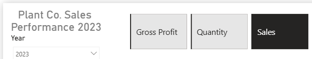
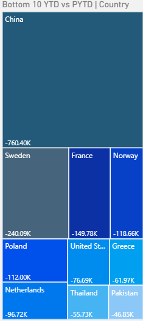
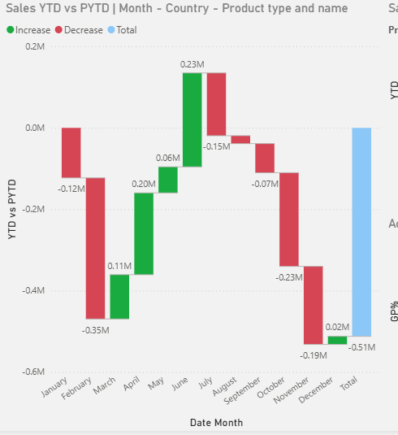
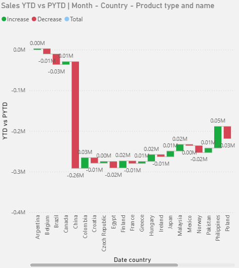
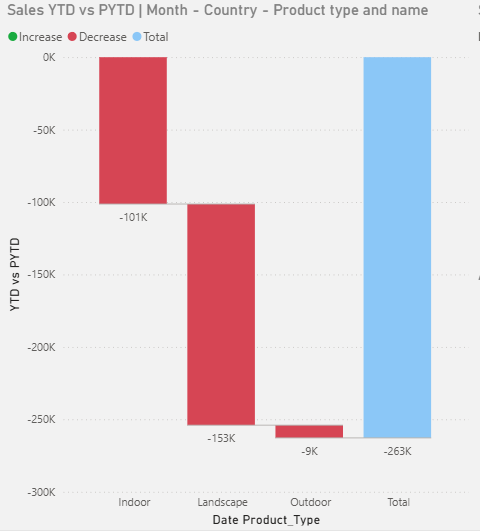
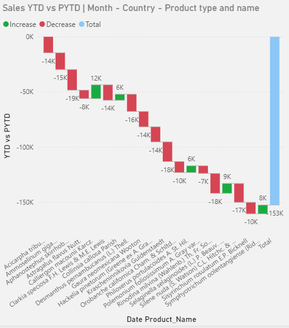
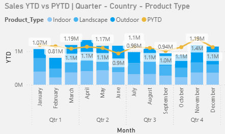
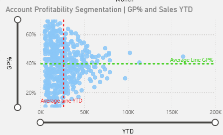

# Plant Co. Sales Performance Report (Power BI)

## Overview
This repository contains a **Power BI performance report** for *Plant Co.* covering **2022–2024**.  
The report is designed as a recruiter-friendly portfolio piece that demonstrates end-to-end Power BI work: **data modelling, DAX measures, time-intelligence comparisons, and interactive report design**.

At a high level, the dashboard lets you pick a **year** and a **metric** (Sales / Gross Profit / Quantity) and then compares **YTD vs PYTD** (current year-to-date vs prior year-to-date) across geography, time, products, and customer profitability.

---

## What’s included
- **Report file:** `PlantCo_Performance_Report.pbix`
- **Data used:** `Data/Plant_DTS.xls`

---

## How to view the dashboard locally
1. Install **Power BI Desktop (64-bit)**.
2. Download or clone this repository.
3. Open: `PlantCo_Performance_Report.pbix`
4. If prompted about data source paths:
   - Update the file path to the dataset (see the `/data` folder if provided), then **Refresh**.
5. Use the slicers/buttons to explore the report.

> Note: `.pbix` files are opened with **Power BI Desktop** (they aren’t viewable directly in GitHub).

---

## Report walkthrough (what’s inside)

### 1) Controls (top section)

- **Year selector (dropdown):** choose the year to analyse (e.g., 2023).
- **Metric selector (buttons):** switch the entire report between:
  - **Sales**
  - **Gross Profit**
  - **Quantity**
- **KPI cards:**
  - **GP%** (Gross Profit %)
  - **YTD** value (for the selected metric and year)
  - **PYTD** value (same metric, prior year-to-date)
  - **Δ YTD vs PYTD** with conditional colouring (positive/negative)

**Idea:** one consistent layout that supports quick YoY performance checks for any metric.

---

### 2) Bottom 10 countries (treemap)

A treemap highlights the **bottom 10 countries** by the selected metric (YTD vs PYTD context), with data labels for quick scanning.

---

### 3) Monthly variance breakdown (waterfall + drilldown)

A waterfall chart shows **month-by-month variance** (YTD vs PYTD).  
It supports drilldown to explain *why* a month changed:

**Month → Country**

**Country → Product Type**

**Product Type → Product**

This makes it easy to pinpoint drivers behind increases/decreases at each level (time, region, category, SKU).

---

### 4) YTD trend vs prior year (stacked columns + line)

A combined chart compares:
- **Stacked columns:** YTD value by month, **split by Product Type**
- **Line:** **PYTD** trend (prior year reference)

This helps you see both **seasonality** and **product mix contribution**, while keeping a clear prior-year benchmark.

---

### 5) Account profitability segmentation (scatter)

A scatter plot segments **customers (accounts)** by:
- **X-axis:** selected metric (e.g., Sales YTD)
- **Y-axis:** **GP%**
- Two average reference lines create **quadrants**, helping identify:
  - High value / high margin customers
  - High value / low margin customers (optimisation targets)
  - Low value / high margin niche customers
  - Low value / low margin customers (review/prioritise)

This view is intended for profitability and account management discussions.

---

## Data (high level)
The report uses a typical BI layout with:
- A **transaction/fact** table (orders/invoices with Sales, GP, Quantity, dates, accounts, products)
- Dimension tables such as:
  - **Date**
  - **Products** (including Product Type)
  - **Accounts / Customers**
  - **Geography** (e.g., Country)

> If you include the dataset in this repo, add it under `/data` and document the source + licensing here.

---

## DAX & modelling highlights
This project focuses on common patterns used in real business reporting:
- **Switchable measures** (one report layout, multiple metrics via buttons)
- **Time intelligence** measures (YTD / PYTD comparison)
- **Dynamic titles / labels** that reflect current selections
- **Average lines** (for quadrant segmentation in the scatter to allow for better context)

---

## Example business questions this report can answer
- Which **countries** are underperforming YoY and by how much?
- Which **months** drove the biggest negative variance, and which countries/products explain it?
- How does **product mix** (Indoor/Landscape/Outdoor) change throughout the year?
- Which **accounts** generate high revenue but low margin (pricing/discount review candidates)?

---

## Repository structure
Recommended layout:
- `PlantCo_Performance_Report.pbix` — Power BI report
- `Images/` — screenshots
- `data/` — dataset files
- `README.md`

